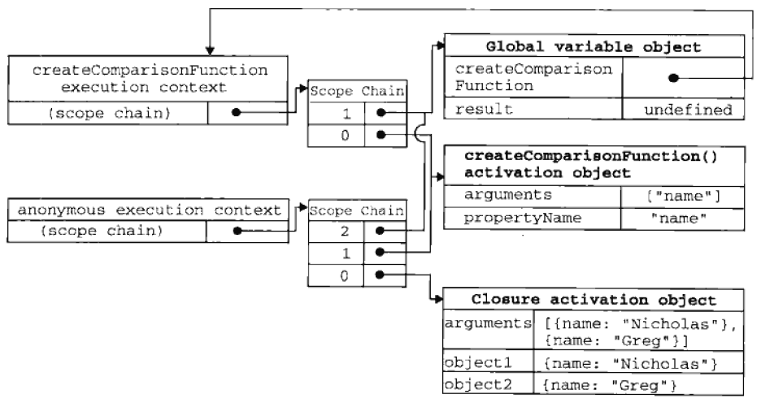

# 函数

## 分类

### 函数声明

```
语法: function fnName([...args]){...}
位置: 全局上下文或函数上下文中
创建: 初始化上下文时
```

### 函数表达式

```
语法: 匿名函数表达式 function([...args]){...}
      命名函数表达式 function fnName([...args]){...}
位置: 表达式位置
创建: 执行上下文代码时
```

### Function构造

```
语法: new Function([...args,] functionBody)
     Function([...args,] functionBody)
位置: 表达式位置
创建: 执行上下文代码时
```

## 创建

```
/*
 * 创建函数对象
 */

// 函数也是对象
F = new NativeObject();

// 类型是"Function"
F.[[Class]] = "Function"

// 原型是Function的prototype属性
F.[[Prototype]] = Function.prototype

// 可接受的参数个数
F.length = countParameters


/*
 * 添加prototype属性
 */

// 是以该函数为构造函数的实例对象的原型
__objectPrototype = new Object();
F.prototype = __objectPrototype;
__objectPrototype.constructor = F;


/*
 * 添加[[Scope]]属性
 */

// 静态存入所有的父作用域，形成作用域链
F.[[Scope]] = activeContext.Scope
// 如果F是命名函数，
F.[[Scope]] = activeContext.Scope+fnName.Scope
// 如果F是通过new Function(...)来创建，
F.[[Scope]] = globalContext.Scope

/*
 * 添加[[Call]]方法
 */

// 使用圆括号时，会激活[[Call]]方法，依次执行
// 1. 创建函数上下文并将F.[[Scope]]复制给上下文对象
// 2. 创建函数的活动对象并将该活动对象添加到作用域链的前端
// 3. 初始化活动对象，执行上下文代码
F.[[Call]] = <reference to function>

/*
 * 添加[[Constructor]]方法
 */

// 使用new关键字时，会激活[[constructor]]方法，此时函数作为构造函数使用，依次执行
// 1. 以F为构造函数，F.prototype为原型创建一个空实例对象
// 2. 调用[[Call]]方法，且将该实例对象赋给this指针
// 3. 返回实例对象
F.[[Construct]] = internalConstructor
```

## 参数

### 实参

* 函数调用时传递的参数
* 函数调用时，会将所有的实参组成一个数组传给`arguments`对象和形参

### arguments对象

* 类数组对象，用于存储实参
* `arguments.length`: 实参个数
* `arguments[index]`: 对应的实参，非严格模式下`arguments[index]`与形参共享值
* `arguments.callee`: 当前正在执行的函数，已废弃，严格模式下抛出TypeError

### 形参

* 函数创建时定义的参数
* 重名时后面的会覆盖前面的，严格模式下会抛出`TypeError`

## 调用

```
直接调用：fnName(实参)
递归调用：在函数内调用函数本身
立即调用: (function(){})();或(function(){}());
```

## 返回值

```
有return，return value
无return，return undefined
```

## 闭包

内部函数被外部引用时形成闭包



### 模仿块级作用域

```
(function () {
  // 块级作用域
})();
```

### 保存变量

```
var data = [];
for (var i = 0; i < 10; i++) {
  data[i] = (function (index) {
    return function () {
      console.log(index);
    }
  })(i);
}
```

### 封装私有属性

```
function Person(name) {
  var _age;

  function setAge(n) {
    _age = n;
  }

  function getAge() {
    return _age;
  }

  return {
    name: name,
    getAge: getAge,
    setAge: setAge
  };
}
```