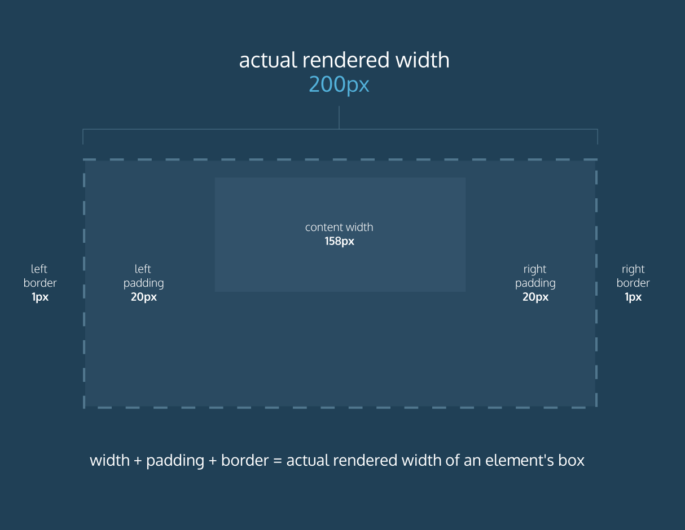

# CSS

定义如何显示`HTML`元素

## 目录

## 推荐资料

* [w3school-css](http://www.w3school.com.cn/css/index.asp)
* [codecademy-html-css](https://www.codecademy.com/learn/learn-html-css)
* 《Head First HTML and CSS》
* 《精通css:高级web标准解决方案》


# 概述

层叠样式表(`Cascading Style Sheets`)

> * 继承：子元素会继承祖先元素的一些样式，如字体样式、文本样式、不透明度
> * 层叠：同一元素可设置多种样式，按优先级确定应用哪一样式

## 插入

### 外部样式表

某个页面的样式

```html
<head>
  <link rel="stylesheet" href="css/site.css">
</head>
```

### 内部样式表

当前页面的样式

```html
<head>
  <style type="text/css">
    body {background-color:yellow}
    p {color:blue}
  </style>
</head>
```

### 内联样式

当前元素的样式

```html
<div style="background:#f8f8f8;"></div>
```

# 语法

## selector

选择器，需要设置样式的某个或某类`HTML`元素

## declaration

声明，要设置的样式，由属性和属性值组成, 以`;`结束

## rule

规则，对某个或某类`HTML`元素设置样式，由选择器和声明组成

```css
selector {
  property1:value1;
  ...
}
```

## sheet

样式表，规则的集合

```css
selector1 {
  property1:value1;
  ...
}

selector2 {
  property1:value1;
  ...
}
```

## media

媒体类型，在某种媒体上应用样式, 默认为`all`

* `all`: 所有媒体设备
* `screen`: 显示器
* `print`: 打印机

限制

* `min-device-width`: 屏幕最小宽度
* `max-device-width`: 屏幕最大宽度
* `min-width`: 浏览器最小宽度
* `max-width`: 浏览器最大宽度

```css
@media screen{
  selector1 {
    property1:value1;
    ...
  }

  selector2 {
    property1:value1;
    ...
  }
}

@media print{
  selector1 {
    property1:value1;
    ...
  }

  selector2 {
    property1:value1;
    ...
  }
}

@media screen and (min-width:768px) and (max-width:992px){
  selector1 {
    property1:value1;
    ...
  }

  selector2 {
    property1:value1;
    ...
  }
}

```

# 文档结构

* 一般性样式
  * reset样式
  * 主体样式
  * 链接
  * 标题
  * 其他元素
* 辅助样式
  * 距离
  * 颜色
  * 背景颜色  
  * 其他辅助样式
* 页面结构
  * 页头、页脚、导航
  * 布局
  * 其他页面结构元素
* 页面组件
* 具体页面


# 选择器

## 通配符选择器

* `*`: 所有元素

```css
/* reset */
*{
  padding:0;
  margin:0;
}
```

## 元素选择器

* `element`: 某类元素

## id选择器

* `#id`: 拥有指定`id`的元素
* `selector#id`: 拥有指定`id`的某个选择器

## 类选择器

* `.class`: 拥有指定类的元素
* `selector.class`: 拥有指定类的某个选择器

## 属性选择器

* `[attribute]`: 拥有指定属性的元素
* `[attribute=value]`: 指定属性的属性值为指定值的元素
* `[attribute~=value]`: 指定属性的属性值可包含多个值且指定值是其中之一的元素
* `[attribute|=value]`: 指定属性的属性值以指定值或指定值-开头的元素
* `[attribute^=value]`: 指定属性的属性值以指定值开头的元素
* `[attribute$=value]`: 指定属性的属性值以指定值结尾的元素
* `[attribute*=value]`: 指定属性的属性值包含指定值的元素
* `selector[attribute]`: 拥有指定属性的某个选择器

## 分组选择器

* `selector1,selector2...`: 多个选择器应用同一套规则

## 后代选择器

* `ancestor descendant`: 某个选择器的后代选择器

## 子代选择器

* `parent>child`: 某个选择器的子代选择器

## 兄弟选择器

* `prev ~ siblings`: 某个选择器后面的所有兄弟选择器

## 相邻兄弟选择器

* `prev + next`: 某个选择器的下一个兄弟选择器

## 伪类选择器

### 效果伪类

* `:link`: 未访问的链接
* `:visited`: 已访问的链接
* `:hover`: 鼠标悬停
* `:focus`: 获取焦点
* `:active`: 激活
* `:target`: 目标
* `:enabled`: 启用
* `:disabled`: 禁用
* `:checked`: 选中

### 角色伪类

* `:first-child`: 作为第一个子元素
* `:last-child`: 作为最后一个子元素
* `:only-child`: 作为唯一一个子元素
* `:nth-child(n)`: 作为第n个子元素
* `:nth-last-child(n)`: 作为倒数第`n`个子元素
* `:first-of-type`: 在子元素中第一个出现的某类元素
* `:last-of-type`: 在子元素中最后一个出现的某类元素
* `:only-of-type`: 在子元素中唯一出现的某类元素
* `:nth-of-type(n)`: 在子元素中第`n`个出现的某类元素
* `:nth-last-of-type(n)`: 在子元素中倒数第`n`个出现的某类元素
* `:empty`: 没有子元素
* `:root`: 作为根元素

### 筛选伪类

* `:lang(value)`: `lang`属性的属性值以指定值开头
* `:not(selector)`: 排除某些选择器


## 伪元素

元素的某一部分

* `:first-letter`: 首字母
* `:first-line`: 首行
* `:before`: 内容之前
* `:after`: 内容之后
* `::selection`: 选中部分


# 优先级

## 样式表优先级

越晚应用优先级越高

浏览器默认样式<外部样式表或内部样式表

## 选择器优先级

描述的越精确优先级越高

分为a,b,c,d四个等级, 依次比较a,b,c,d

* `a`: 行内样式为1
* `b`: `id`选择器的数目
* `c`: 类选择器、伪类选择器、属性选择器的数目
* `d`: 通配符选择器、元素选择器、伪元素选择器的数目

## 样式优先级

普通样式<`!important`样式

## 应用样式

收集元素的某个样式，先按样式优先级排序，再按选择器优先级排序，之后按样式表优先级排序，最后按出现的顺序排序，排序完后后面的样式会覆盖前面的样式和继承的样式


# 样式值

## 字体

### 通用字体系列

拥有相似外观的字体系统组合

* `Serif`：有衬线，多用于新闻报纸的文字排版
* `Sans-serif`：无衬线，多用于计算机屏幕
* `Monospace`：等宽字体，多用于软件代码示例
* `Cursive`： 手写体
* `Fantasy`：幻想体

### 特定字体系列

具体的字体系列

* `Times`
* `Courier`

### web字体

托管在服务器上的字体

* `.ttf`: `TureType`字体格式
* `.otf`: `OpenType`字体格式
* `.eot`: `Embedded OpenType`字体格式
* `.svg`: `SVG`字体格式
* `.woff`: `Web`开放字体格式

使用`web`字体

```css
@font-face{
  font-family:<font-family>;
  src:url("<url>"),...
}
```


## 尺寸

`CSS`用以下方式表示尺寸

* `%`: 百分比
* `px`: 像素
* `em`: 字体大小

## 颜色

`CSS`用以下方式表示颜色

* 颜色名：`transparent, aqua, black, blue, fuchsia, gray, green, lime, maroon, navy, olive, orange, purple, red, silver, teal, white, yellow`等147种颜色
* 十六进制颜色：`#RRGGBB`, RR(红色)、GG(绿色)、BB(蓝色), 值`00~FF`之间，`#rrggbb`形式的十六进制颜色可简写为`#rgb`
* RGB颜色: `rgb(red, green, blue)`，值`0~255`或`0% ~100%`之间
* RGBA颜色: `rgba(red, green, blue, alpha)`, `alpha`为不透明度，值`0~1`之间
* HSL颜色：`hsl(hue, saturation, lightness)`, hue(色调)(0~360)(红-绿-蓝), saturation(饱和度)(0%~100%)(灰-全彩), lightness(亮度)(0%~100%)(黑-白)
* HSLA 颜色: hsla(hue, saturation, lightness, alpha)


# 文本样式

## 注释

```css
/* comment */
```

## 字体

* `font-family`: 文本的字体, 默认为`"Times New Roman"`
  * `字体`: 可定义多个字体作为备用，最后一个通常为字体系列，字体名有空格时需要用引号
* `font-style`: 字体风格，默认为`normal`
  * `normal`: 正常显示
  * `italic`: 斜体显示
  * `oblique`: 倾斜显示
* `font-variant`: 字体变形，默认为`normal`
  * `normal`: 正常
  * `small-caps`: 小型大写字母
* `font-weight`: 字体加粗，默认为`normal`
  * `normal`: 正常
  * `bold`: 粗体
  * `bolder`: 更粗
  * `lighter`: 更细
  * `<100|200...|900>`: 400相当于`normal`，700相当于`bold`
* `font-size`: 字体大小, 推荐`body`用`length`, 其他用`em`或`percentage`
  * `length`: 固定尺寸
  * `percentage`: 相对于父字体大小而言
  * `em`: 相对于父字体大小而言
  * `关键字`：`xx-small, x-small, small, medium, large, x-large, xx-large`
* `font:[font-style] [font-variant] [font-weight] [font-size[/line-height]] [font-family]`: 字体

## 文本

* `color`: 文本颜色
* `direction`: 文本方向
  * `ltr`: 从左到右
  * `rtl`: 从右到左
* `line-height`: 行高
  * `尺寸`：行高多少
  * `number`: 自身字体大小的多少倍
* `text-indent`: 缩进，一般设置`2em`
* `text-align`: 水平对齐，默认为`left`
  * `left`: 左对齐
  * `center`: 居中对齐
  * `right`: 右对齐
  * `justify`: 两端对齐
* `vertical-align`: 垂直对齐, 默认为`baseline`
  * `baseline`: 基线对齐
  * `top`: 顶端对齐
  * `middle`: 中间对齐
  * `bottom`: 底端对齐
  * `length`: 允许负数
  * `percentage`: 相对于`line-height`而言
* `text-transform`: 大小写处理，默认为`none`
  * `none`: 不处理
  * `uppercase`: 大写
  * `lowercase`: 小写
  * `capitalize`: 首字母大写
* `text-decoration`: 文本装饰，默认为`none`，可指定多个
  * `none`: 无装饰
  * `underline`: 下划线
  * `overline`: 上划线
  * `line-through`: 删除线
  * `blink`: 闪烁
* `word-spacing`: 字/单词的间隔，默认为`normal`
  * `normal`: 正常间隔
  * `尺寸`：间隔多少
* `letter-spacing`: 字符的间隔，默认为`normal`
  * `normal`: 正常间隔
  * `尺寸`：间隔多少
* `white-space`: 空白符处理，默认为`normal`
  * `normal`: 合并空白符，忽略换行符，允许自动换行
  * `nowrap`: 合并空白符，忽略换行符，不允许自动换行
  * `pre`: 保留空白符，保留换行符，不允许自动换行
  * `pre-wrap`: 保留空白符，保留换行符，允许自动换行
  * `pre-line`: 合并空白符，保留换行符，允许自动换行
* `text-shadow: [h-shadow] [v-shadow] [blur] [color]`: 文本阴影
  * `h-shadow`: 阴影的水平偏移
  * `v-shadow`：阴影的垂直偏移
  * `blur`: 模糊距离
  * `color`: 阴影颜色
* `word-break`: 自动换行方式, 默认为`normal`
  * `normal`: 默认换行规则
  * `break-all`: 允许单词内换行
  * `keep-all`: 只能在半角空格或连字符处换行
* `word-wrap`: 长单词换行处理，默认为`normal`
  * `normal`: 长单词不自动换行
  * `break-word`: 长单词自动换行
* `text-overflow`: 文本溢出处理，要与`overflow:hidden`配合
  * `clip`: 修剪文本
  * `ellipsis`: 使用省略号代表修剪的文本
  * `string`: 使用指定字符串代表修剪的文本
* `cursor`: 光标，默认`default`
  * `url("<url>")`: 自定义光标
  * `default`: 箭头
  * `pointer`: 手型
  * `crosshair`: 十字线
  * `move`: 移动
  * `text`: 文本
  * `wait`: 忙碌
  * `help`: 帮助


# 盒模型


四边尺寸处理

* `一个尺寸`: 上/下/左/右
* `两个尺寸`: 上/下 左/右
* `三个尺寸`：上 左/右 下
* `四个尺寸`：上 右 下 左(顺时针方向)

## width/height

行内框不能设置尺寸

* `width`: 元素的宽，默认为`auto`
  * `auto`: 自动计算, 普通流块元素为`100%`, 其他由子元素决定
  * `length`: 宽
  * `percentage`: 相对于父元素的`width`而言
* `min-width`: 元素的最小宽度
* `max-width`: 元素的最大宽度
* `height`: 元素的高，默认为`auto`
  * `auto`: 自动计算, 由子元素决定
  * `length`: 高
  * `percentage`: 相对于父元素的`height`而言
* `min-height`: 元素的最小高度
* `max-height`: 元素的最大高度

## padding

尺寸不能为负，百分比相对于父元素的宽度而言

* `padding-top`: 上内边距
* `padding-bottom`: 下内边距
* `padding-left`: 左内边距
* `padding-right`: 右内边距
* `padding`: 内边距

## margin

尺寸可以为负，可以为`auto`, 百分比相对于父元素的宽度而言

* `margin-top`: 上外边距
* `margin-bottom`: 下外边距
* `margin-left`: 左外边距
* `margin-right`: 右外边距
* `margin`: 外边距

## 外边距合并

普通文档流中块元素的垂直外边距相遇时，会合并为一个外边距，高度为大的外边距

### 兄弟元素


### 父子元素


### 空元素


## box-sizing

* `box-sizing`: 宽高对应的框，默认为`content-box`
  * `content-box`: 宽高为`content-box`的尺寸
  * `border-box`: 宽高为`border-box`的尺寸

content-box



border-box


## display

* `display`: 显示方式
  * `none`: 不显示，不存在
  * `block`: 块元素
  * `inline`: 内联元素
  * `inline-block`: 行内块元素
  * `table`: 表格元素
  * `tabel-row`: 表格行元素
  * `table-cell`: 表格单元格元素

## 可见性

* `opacity`: 不透明度，`0~1`之间，会被子元素继承
* `visibility`: 是否可见，默认`visible`
  * `visible`: 可见
  * `hidden`: 不可见，仍存在

## overflow

* `overflow`: 框溢出处理，默认为`visible`
  * `visible`: 不裁剪，直接显示
  * `hidden`: 裁剪
  * `scroll`: 显示滚动条
  * `auto`: 自动显示滚动条
* `overflow-x`: 水平方向溢出处理
* `overflow-y`: 垂直方向溢出处理

## border

* `border-width`: 四条边框宽度，默认为`0`
  * `尺寸`：边框宽度
  * `thin`: 薄
  * `medium`: 中等
  * `thick`: 厚
* `border-style`: 四条边框样式，默认为`none`
  * `none`: 无边框
  * `solid`: 实线
  * `dashed`: 虚线
  * `dotted`: 点线
  * `double`: 双线
  * `groove`: 3D凹槽
  * `ridge`: 3D凸槽
  * `inset`: 3D凹边
  * `outset`: 3D凸边
* `border-color`: 四条边框颜色, 默认与`color`有关
* `border:[border-width] [border-style] [border-color]`: 四条边框
* `border-top:[border-top-width] [border-top-style] [border-top-color]`: 上边框
* `border-bottom:[border-bottom-width] [border-bottom-style] [border-bottom-color]`: 下边框
* `border-left:[border-left-width] [border-left-style] [border-left-color]`: 左边框
* `border-right:[border-right-width] [border-right-style] [border-right-color]`: 右边框

## border-radius

圆角半径最大为`border-box`宽高较小值的一半，大于这个值时当作这个值处理

* `border-top-left-radius`: 左上角圆角
* `border-top-right-radius`: 右上角圆角
* `border-bottom-left-radius`: 左下角圆角
* `border-bottom-right-radius`: 右下角圆角
* `border-radius`: 四个圆角

## outline

绘制在`border-box`外，不影响页面布局

* `outline-width`: 轮廓宽度
* `outline-style`: 轮廓样式
* `outline-color`: 轮廓颜色
* `outline:[outline-width] [outline-style] [outline-color]`: 轮廓

## background

通常将多个图标放置在一张图片上，以减少请求次数，可提供多个背景

* `background-color`: 背景颜色，默认为`transparent`
* `background-image`: 背景图片，默认为`none`
  * `none`: 无背景图片
  * `url("<url>")`: 背景图片地址
* `background-repeat`: 背景重复，默认为`repeat`
  * `no-repeat`: 不重复
  * `repeat`: x, y方向都平铺
  * `repeat-x`: x方向平铺
  * `repeat-y`: y方向平铺
* `backgound-position`: 背景位置，默认为左上角
  * `关键字`：`<left|center|right> <top|center|bottom(默认为center)>`
  * `百分比`：`x% y%`
  * `尺寸`：`x y`, 相对于左上角而言，可以为负
* `background-origin`: `background-position`相对什么定位，默认为`border-box`
  * `content-box`: 内容框
  * `padding-box`: 内边距框
  * `border-box`: 边框
* `background-clip`: 背景的绘制区域, 默认为`border-box`
  * `content-box`: 内容框
  * `padding-box`: 内边距框
  * `border-box`: 边框
* `background-size`: 背景图片大小
  * `length`: 第一个值为宽度，第二个值为高度(默认为`auto`)
  * `percentage`: 相对于父元素的`width`而言
  * `contain`: 覆盖内容区域
  * `cover`: 覆盖背景区域
* `background-attachment`: 背景关联，默认为`scroll`
  * `scroll`: 随页面滚动
  * `fixed`: 固定，不随页面滚动
* `background:[background-color] [background-image] [background-repeat] [background-position]`: 背景样式


## box-shadow

* `box-shadow: [h-shadow] [v-shadow] [blur] [spread] [color] [inset],...`: 添加一个或多个阴影
  * `h-shadow`: 阴影的水平偏移
  * `v-shadow`: 阴影的垂直偏移
  * `blur`: 模糊距离
  * `spread`: 阴影尺寸
  * `color`: 阴影颜色
  * `inset`: 将外部阴影`outset`改为内部阴影


# 定位机制

* 普通流
* 浮动
* 定位

## 普通流

* 元素的位置由元素在`HTML`中的位置决定
* 块级框从上到下一个接一个排列，框之间的垂直距离由框的垂直外边距合并而成
* 行内框在一行中水平排列，可以使用水平内边距、水平边框、水平外边距、影响行内框的排布，垂直内边距、垂直边框、垂直外边距不影响行内框的排布，`vertical-align`影响垂直分布
* 行内块框在一行中水平排列，宽高、内边距、边框、外边距都会影响行内块框的排布，`vertical-align`影响垂直分布

## 浮动

浮动的框可以向左或向右移动，直到它的外边缘碰到父元素框或另一个浮动框为止

* `float`: 浮动, 默认为`none`
  * `none`: 不浮动
  * `left`: 向左浮动，自动变成块级框，原来所占的位置删除，占用覆盖位置
  * `right`: 向右浮动，自动变成块级框，原来所占的位置删除，占用覆盖位置


尺寸不够时往下排列


* `clear`: 清除浮动，默认为`none`
  * `none`: 不清除浮动
  * `left`: 清除左浮动，元素左边不允许有浮动内容
  * `right`: 清除右浮动，元素右边不允许有浮动内容
  * `both`: 清除左右浮动，元素左右两边不允许有浮动内容


```css
/*清除浮动*/

.clearfix:before,
.clearfix:after{
  content:" ";
  display:block;
}

.clearfix:after{
  clear:both
}

/* or */
.clearfix{
  overflow:hidden;
}
```

## 定位

* `position`: 定位，默认为`static`
  * `static`: 静态定位，元素框正常生成
  * `relative`: 相对定位，元素框可以相对于原来的位置偏移，原来所占的位置仍保留
  * `absolute`: 绝对定位，元素框可以相对于最近的已定位的祖先元素偏移(没有时相对于`body`元素)，自动变成块级框，原来所占的位置删除
  * `fixed`: 固定定位，元素框可以相对于浏览器窗口位置偏移，自动变成块级框，原来所占的位置删除，页面滚动时仍不动
* `top`: 盒模型的上偏移，正数对应下移, 百分数相对于浏览器窗口宽度而言
* `bottom`: 盒模型的下偏移，正数对应上移
* `left`: 盒模型的左偏移，正数对应右移
* `right`: 盒模型的右偏移，正数对应左移
* `z-index`: 堆叠顺序，默认为`auto`
  * `auto`: 与父元素相同
  * `number`: 设置堆叠顺序，越大越在上面


# 常用样式

## 链接

* `a:link`: 未访问的链接
* `a:visited`: 访问了的链接
* `a:hover`: 鼠标移上去的链接，得放在`a:link`, `a:visited`后面
* `a:focus`: 获取焦点的链接，得放在`a:link`, `a:visited`后面
* `a:active`: 点中的链接，得放在`a:hover`, `a:focus`后面
* `a[href^="http:"]:not([href^="http://yoursite"])`: 外部链接样式
* `a[href^="mailto"]`: 邮箱链接样式
* `a[href$=".doc"]`: 下载`doc`文件的链接样式

## 列表

* `list-style-type`: 列表项标记类型，默认为`none`
  * `none`: 无标记
  * `disc`: 实心圆，无序列表默认类型
  * `circle`: 空心圆
  * `square`: 实心方块
  * `decimal`: 数字，有序列表默认类型
  * `lower-roman`: 小写罗马数字
  * `upper-roman`: 大写罗马数字
  * `lower-alpha`: 小写英文字母
  * `upper-alpha`: 大写英文字母
  * `lower-greek`: 小写希腊字母
* `list-style-position`: 列表项标记位置，默认为`outside`
  * `outside`: 文本外
  * `inside`: 文本内
* `list-style-image`: 列表项图片，默认为`none`
  * `none`: 无
  * `url("<url>")`: 图片路径
* `list-style:[list-style-type] [list-style-position] [list-style-image]`: 列表项样式

### 垂直导航条

```html
<ul class="nav">
  <li><a href="home.html">Home</a></li>
  <li><a href="product.html">Product</a></li>
  <li><a href="news.html">News</a></li>
  <li><a href="about.html">About</a></li>
</ul>
```

```css
/* 关键点
a: display:block
*/
```

### 水平导航条

```html
<ul class="nav">
  <li><a href="home.html">Home</a></li>
  <li><a href="product.html">Product</a></li>
  <li><a href="news.html">News</a></li>
  <li><a href="about.html">About</a></li>
</ul>
```

```css
/* 关键点
ul: 去浮动
li: float:left;
a: display:block;
*/
```

### 下拉菜单

```html
<ul class="nav">
  <li><a href="home.html">Home</a></li>
  <li>
    <a href="product.html">Product</a>
    <ul>
      <li><a href="product/disk">Disk</a></li>
      <li><a href="product/ip">Ip</a></li>
    </ul>
  </li>
  <li><a href="news.html">News</a></li>
  <li><a href="about.html">About</a></li>
</ul>

```

```css
/* 关键点
.nav: 去浮动
.nav>li: float:left
.nav a: display:block
.nav ul: position:absolute;display:none;
.nav>li:hover>ul: display:block;
*/
```

## 表格

* `border-collapse`: 合并边框，默认`separate`
  * `separate`: 不合并
  * `collapse`: 合并边框
* `border-spacing`: 单元格外边距，使用`margin`设置单元格外边距时无效
  * `x y`: 水平间距、垂直间距
* `caption-side`: 标题位置，默认`top`
  * `top`: 表格之上
  * `bottom`: 表格之下
* `table-layout`: 表格布局
  * `automatic`: 自动布局
  * `fixed`：固定布局

## 表单

通常采用表格布局

```html
<form class="display-table">
  <div class="display-table-row">
    <p class="display-table-cell">lable</p>
    <p class="display-table-cell">control</p>
  </div>
</form>
```

## 布局

### 固定宽度布局

尺寸采用固定宽度

```css
.container{
  width:920px;
  margin:0 auto;
}
```

### 流式布局

尺寸采用百分数

```css
.container{
  width:80%;
  margin:0 auto;
  max-width:125em;
  min-width:62em;
}
```

### 弹性布局

尺寸采用字号

```css
.container{
  width:92em;
  max-width:95%;
  margin:0 auto;
}
```

## 居中

### 水平居中

行内元素

```css
.text-center{
  text-align:center;
}
```

定宽块元素

```css
.container{
  width:1000px;
  margin-left:auto;
  margin-right:auto;
}
```

不定宽块元素

```css
.center{
  position:absolute;
  left:50%;
  transform:translateX(-50%);
}
```

## 垂直居中

一行文本

```css
.middle{
  height:30px;
  line-height;30px;
}
```

内联元素

```css
.middle{
  padding:20px 0;
}
```

定高块元素

```css
.middle{
  position:absolute;
  top:50%;
  height:200px;
  margin-top:-100px;
}
```

不定高块元素

```css
.middle{
  position:absolute;
  top:50%;
  transform:translateY(-50%);
}
```


# 兼容性

* 不同浏览器对样式的支持不同，可到[Can I Use](http://caniuse.com/#)上查看浏览器的支持性
* 不同浏览器对样式的实现不同，可能会造成bug
* 不同显示屏的分辨率不同，页面显示会有差别

## IE的bug

IE6及以下使用布局概念来控制元素的尺寸和定位，是许多bug的根源

* `width`相当于`min-width`, `height`相当于`min-height`
* 布局元素的外边距不叠加
* 布局元素对浮动进行自动清理
* 相对定位元素没有布局时绝对定位元素无法定位
* 没有布局的块级链接上，单击区域只覆盖文本
* 滚动时，列表项上的背景图片间歇性显示和消失

### 常见bug及修复

IE9以下不支持`opacity`

```css
selector{
  opacity:0.8;
  filter:alpha(opacity=80);
}
```

IE6的宽高指的是`border-box`

```css
selector{
  box-sizing:border-box;
}
```

IE6不支持`PNG`透明度

```css
selector{
  filter:progid:DXImageTransform.Microsoft.AlphaImageLoader(src="image/test.png", sizingMethod="crop");
  background:none;
}

/* or */
selector{
  behavior:url(iepngfix.utc);
}
```

IE6列表项上下添加了额外的空间

```css
selector{
  display:inline;
}
```

IE6不显示内容隐藏在屏幕之外的链接

```
selector{
  background-image:url("img/shim.gif"); /*一个透明的图片*/
}
```

IE6不支持`margin:0 auto`

```css
parent{
  text-align:center;
}

child{
  margin:0 auto;
  text-align:left;
}
```

IE6的浮动元素的外边距加倍

```css
selector{
  float:left;
  margin-left:20px;
  display:inline;
}
```

IE6的浮动元素间有超过两个注释时，最后一个浮动元素的最后几个字符会重复出现

## 解决方法

### IE条件注释

根据条件显示代码块

```html
<!--[if IE]>只有IE才能看到<![endif]-->
<!--[if IE 6]>只有IE6才能看到<![endif]-->
<!--[if lt IE7]>只有比IE7更低(lower than，不包括IE7)的IE才能看到<![endif]-->
<!--[if gte IE7]>只有大于等于IE7 (greater than or equal to)的IE才能看到<![endif]-->
<!--[if (gte IE6)&(lt IE 8)]>只有大于等于IE6，且小于IE8的IE能看到<![endif]-->
<!--[if (IE 7)|(IE6)]>只有IE6和IE7能看到<![endif]-->
```

