# 盒模型

四边尺寸处理

* `四个尺寸`：上 右 下 左(顺时针方向)
* `三个尺寸`：上 左/右 下(第四个值与第二个值相同)
* `两个尺寸`: 上/下 左/右(第三个值与第一个值相同)
* `一个尺寸`: 上/下/左/右(第二个值与第一个值相同)

## width/height

行内非替换元素不能设置宽高

* `width`: 元素的宽，默认为`auto`
  * `auto`: 自动计算，块元素由盒模型决定，行内元素由内容决定
  * `length`: 宽
  * `percentage`: 相对于父元素的宽而言

* `height`: 元素的高，默认为`auto`
  * `auto`: 自动计算, 由内容决定
  * `length`: 高
  * `percentage`: 相对于父元素的高而言

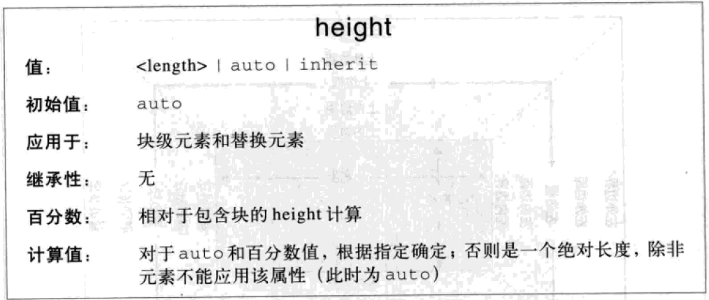

* `min-width`: 元素的最小宽度
* `min-height`: 元素的最小高度

* `max-width`: 元素的最大宽度
* `max-height`: 元素的最大高度

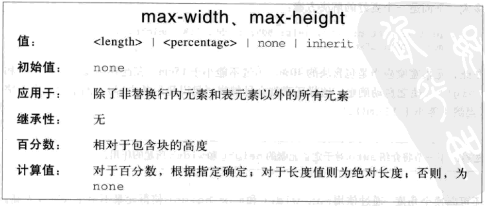

## padding

尺寸不能为负，百分比相对于父元素的宽度而言

* `padding-top`: 上内边距
* `padding-bottom`: 下内边距
* `padding-left`: 左内边距
* `padding-right`: 右内边距
* `padding`: 内边距

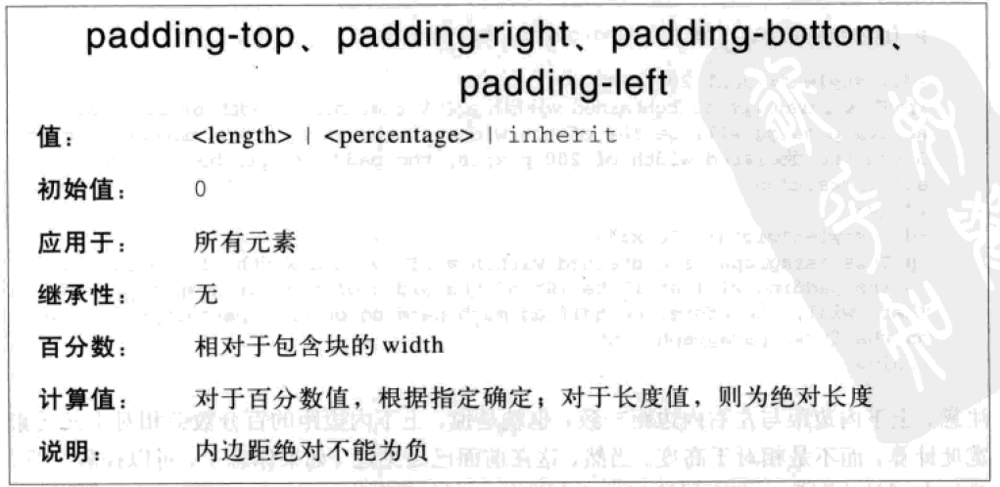

## margin

尺寸可以为负，可以为`auto`, 百分比相对于父元素的宽度而言

* `margin-top`: 上外边距
* `margin-bottom`: 下外边距
* `margin-left`: 左外边距
* `margin-right`: 右外边距
* `margin`: 外边距

## 外边距合并

同一个BFC中的块元素的垂直外边距相遇时，会合并为一个外边距

1. 将相遇的垂直外边距按正负化为两类
2. 正的一类取大的，负的一类取小的
3. 将取得的两个值相加，为合并后的外边距大小

### 兄弟元素

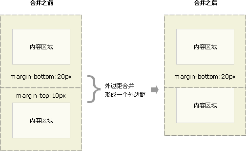

### 父子元素

### 空元素

## box-sizing

* `box-sizing`: 宽高对应的框，默认为`content-box`
  * `content-box`: 宽高为`content-box`的尺寸
  * `border-box`: 宽高为`border-box`的尺寸

content-box

border-box

## display

浮动或定位时，`display`会重新计算

* `display`: 显示方式，默认为`inline`
  * `none`: 不存在，从普通流中删除
  * `block`: 块元素
  * `inline`: 行内元素
  * `inline-block`: 行内块元素
  * `run-in`: 根据上下文作为块级元素或行内元素显示
  * `list-item`: 列表项
  * `table`: 块级表
  * `inline-talbe`: 行内表
  * `table-row`: 行
  * `table-row-group`: 行组
  * `table-header-group`: 表头
  * `table-footer-group`: 表注
  * `table-colume`: 列
  * `table-column-group`: 列组
  * `table-cell`: 单元格
  * `table-caption`: 表标题

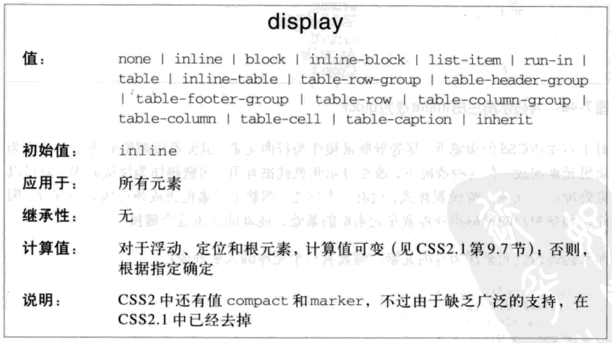

## visibility

* `visibility`: 可见性，默认`visible`
  * `visible`: 可见
  * `hidden`: 隐藏，仍存在
  * `collapse`: 表元素时隐藏一行或一列，其他元素等同于`hidden`

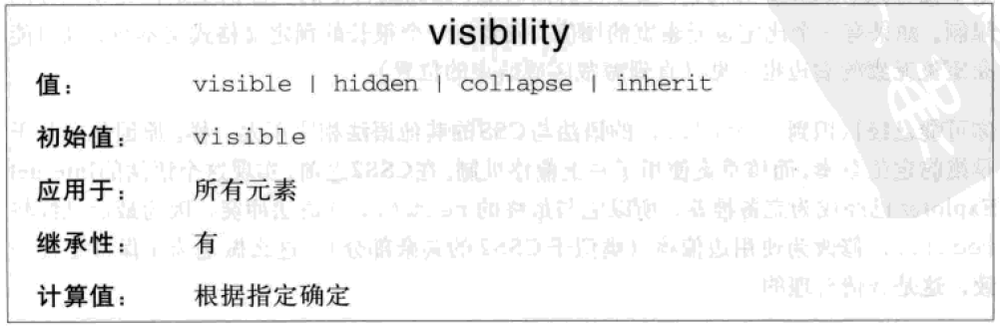

## opacity

* `opacity`: 不透明度，`0~1`之间，会被子元素继承

## overflow

* `overflow`: 内容溢出可视区域处理，默认为`visible`
  * `visible`: 显示溢出部分
  * `hidden`: 隐藏溢出部分
  * `scroll`: 显示滚动条
  * `auto`: 自动显示滚动条
* `overflow-x`: 水平方向溢出处理
* `overflow-y`: 垂直方向溢出处理

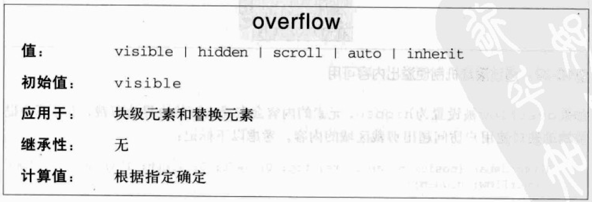

## clip

* `clip`: 裁剪绝对定位元素或固定定位元素的可视区域，默认为`auto`
  * `auto`: 不裁剪
  * `rect(<top>, <right>, <bottom>, <left>)`: 裁剪一个矩形，值为矩形各边距内边距框左上角的距离

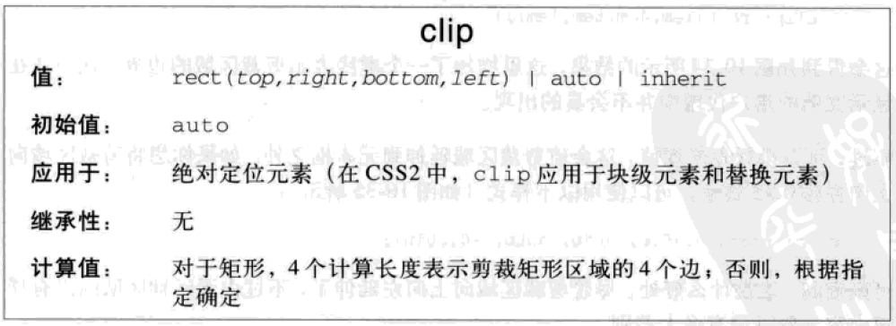

## border

* `border-width`: 四条边框宽度，默认为`medium`
  * `length`：具体长度
  * `关键字`：`thin,medium,thick`

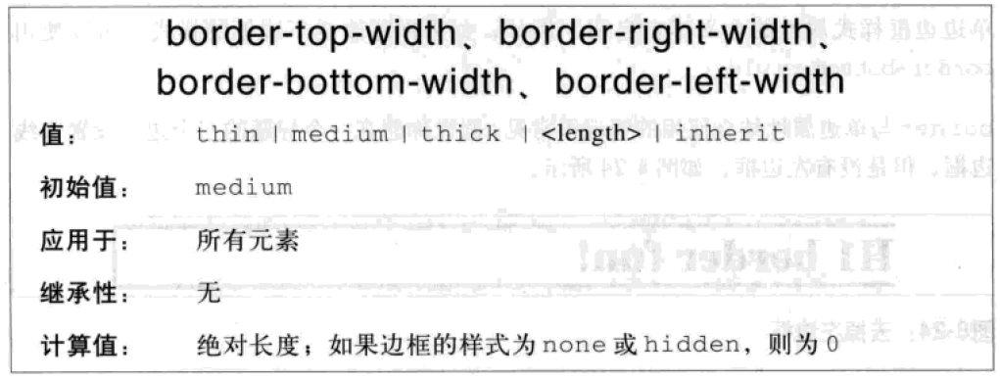

* `border-style`: 四条边框样式，默认为`none`
  * `none`: 无边框
  * `hidden`: 隐藏
  * `solid`: 实线
  * `dashed`: 虚线
  * `dotted`: 点线
  * `double`: 双线
  * `groove`: 3D凹槽
  * `ridge`: 3D凸槽
  * `inset`: 3D凹边
  * `outset`: 3D凸边

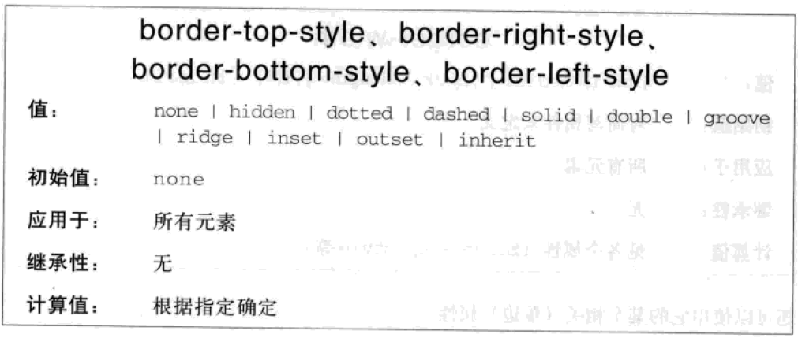

* `border-color`: 四条边框颜色, 默认为文本颜色

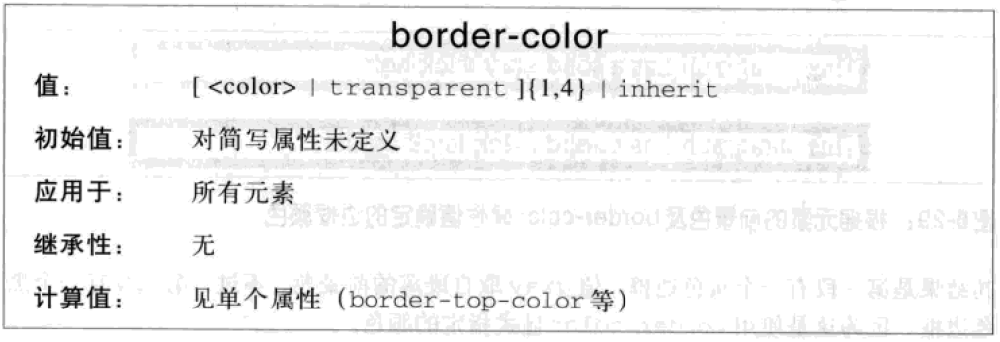

* `border-top:[border-top-width] [border-top-style] [border-top-color]`: 上边框
* `border-bottom:[border-bottom-width] [border-bottom-style] [border-bottom-color]`: 下边框
* `border-left:[border-left-width] [border-left-style] [border-left-color]`: 左边框
* `border-right:[border-right-width] [border-right-style] [border-right-color]`: 右边框
* `border:[border-width] [border-style] [border-color]`: 四条边框

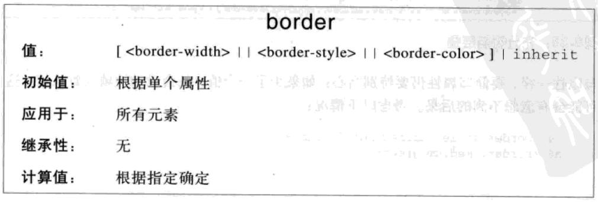

## border-radius

对`border-box`作圆角处理

* 有边框时对边框外侧作圆角处理，边框内侧圆角半径为`max(0,<border-radius>-<border-width>)`
* 当任意两个相邻圆角半径之和大于`border-box`尺寸时，必须按比例减小圆角半径直至不会重叠

* `border-top-left-radius`: 左上角圆角
  * `r`: 半径为`r`的圆
  * `a/b`: 水平半径为`a`, 垂直半径为`b`的椭圆
* `border-top-right-radius`: 右上角圆角
* `border-bottom-left-radius`: 左下角圆角
* `border-bottom-right-radius`: 右下角圆角
* `border-radius`: 四个圆角，从左上角开始以顺时针顺序指定四个圆角
  * `<r>{1,4}`:四个圆角
  * `<a>{1,4}/b{1,4}`:四个椭圆角

## outline

绘制在`border-box`外，不影响页面布局，常用于指示当前焦点

* `outline-width`: 轮廓宽度

* `outline-style`: 轮廓样式

* `outline-color`: 轮廓颜色

* `outline:[outline-width] [outline-style] [outline-color]`: 轮廓

* `outline-offset`: 轮廓偏移
  * `length`: 轮廓与边框边缘的距离，可为负

## background

* `background-color`: 背景颜色，默认为`transparent`，位于最底层

* `background-image`: 背景图片，默认为`none`，可添加多个，层层叠加，第一层背景图片位于最顶层
  * `none`: 无背景图片
  * `url("<url>")`: 背景图片地址

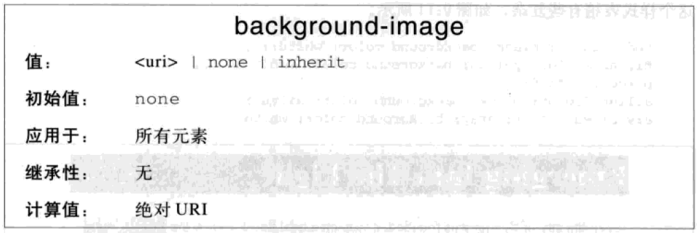

* `background-repeat`: 背景重复，默认为`repeat`
  * `no-repeat`: 不重复
  * `repeat`: x, y方向都平铺
  * `repeat-x`: x方向平铺
  * `repeat-y`: y方向平铺

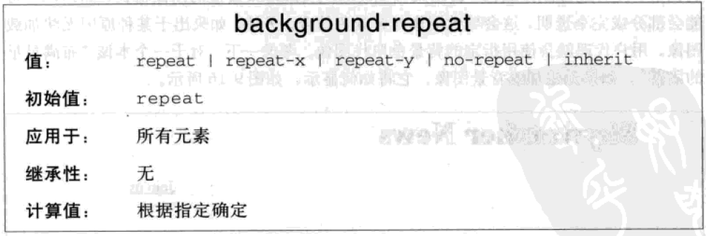

* `backgound-position`: 背景位置，默认为`0% 0%`
  * `关键字`：`<left|center|right> <top|center|bottom>`，一个关键字时，另一个默认为`center`
  * `水平关键字 水平偏移 垂直关键字 垂直偏移`：先到关键字位置，再进行偏移
  * `percentage`：`x% y%`，一个百分比时，另一个默认为`50%`
  * `length`：`x y`, 相对于左上角而言，可以为负

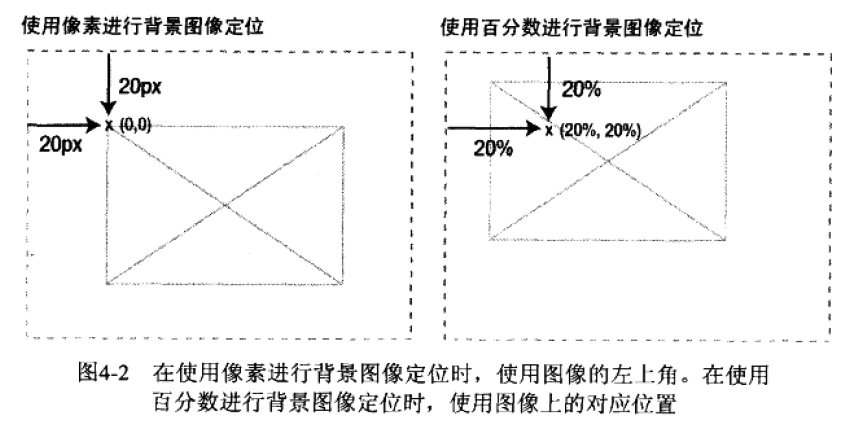

* `background-origin`: `background-position`相对什么定位，默认为`padding-box`
  * `content-box`: 内容框
  * `padding-box`: 内边距框
  * `border-box`: 边框

* `background-clip`: 背景的可视区域, 默认为`border-box`
  * `content-box`: 内容框
  * `padding-box`: 内边距框
  * `border-box`: 边框

* `background-size`: 背景图片大小
  * `length`: 第一个值为宽度，第二个值为高度(默认为`auto`)
  * `percentage`: 相对于父元素的`width`而言
  * `contain`: 覆盖内容区域
  * `cover`: 覆盖背景区域

* `background-attachment`: 背景关联，默认为`scroll`
  * `scroll`: 背景位置相对于元素而言
  * `fixed`: 背景位置相对于浏览器窗口而言

* `background:[background-color] [background-image] [background-repeat] [background-attachment] [background-position[ / background-size]]...`: 背景样式

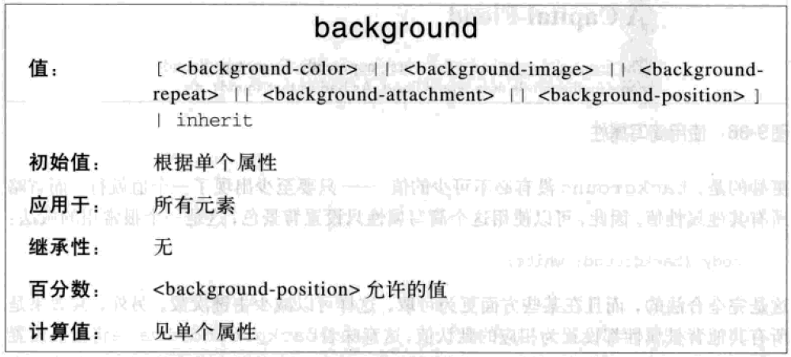

## box-shadow

可添加多个，层层叠加，第一层投影位于最顶层

* `box-shadow: [h-shadow] [v-shadow] [blur] [spread] [color] [inset]...`: 阴影
  * `h-shadow`: 阴影的水平偏移
  * `v-shadow`: 阴影的垂直偏移
  * `blur`: 模糊距离
  * `spread`: 扩张半径
  * `color`: 阴影颜色，默认为文本颜色
  * `inset`: 将外部阴影`outset`改为内部阴影