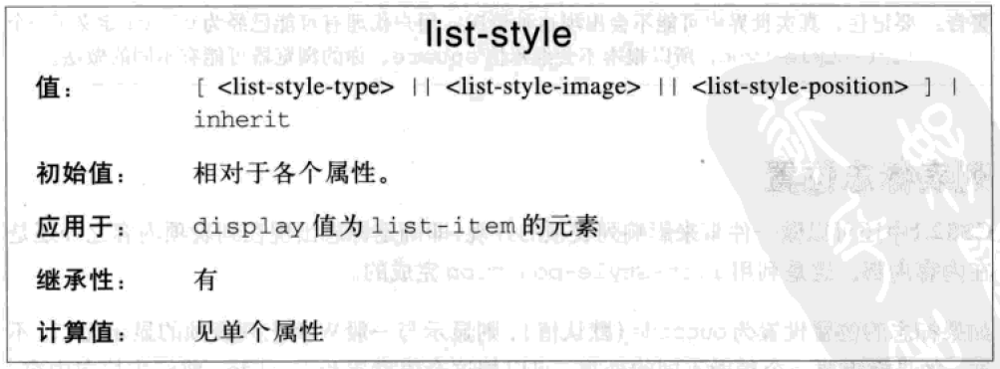
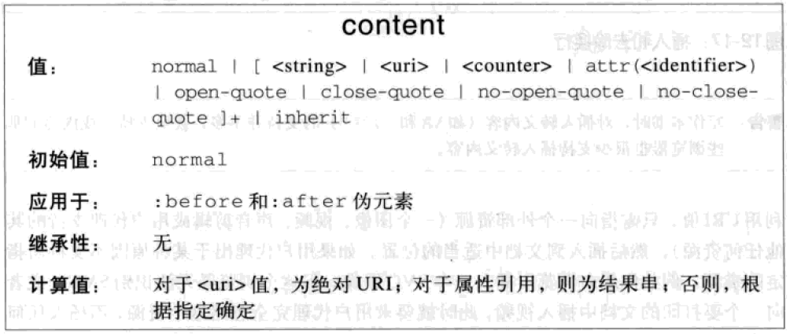

# 列表与生成内容

## 列表项标志

标志类型

* `list-style-type`: 列表项标志类型，默认为`disc`
  * `none`: 无标志
  * `disc`: 实心圆，无序列表默认类型
  * `circle`: 空心圆
  * `square`: 实心方块
  * `decimal`: 数字，有序列表默认类型
  * `lower-roman`: 小写罗马数字
  * `upper-roman`: 大写罗马数字
  * `lower-alpha`: 小写英文字母
  * `upper-alpha`: 大写英文字母
  * `lower-greek`: 小写希腊字母

图像标志

* `list-style-image`: 列表项图像标志，默认为`none`
  * `none`: 无
  * `url("<url>")`: 图像路径

标志位置

* `list-style-position`: 列表项标志位置，相对于列表项的内容定位，默认为`outside`
  * `outside`: 列表项外
  * `inside`: 列表项内

简写

* `list-style:[list-style-type] [list-style-position] [list-style-image]`: 列表项标志样式

## 生成内容

使用`:before`和`:after`伪元素来插入生成内容

<!--### 限制

* 禁止浮动和定位
* 禁止列表样式和表样式
* `display`处理
  * 选择器为块元素，`display`只能为`none, inline, block, marker`, 其它的作为`block`处理
  * 选择器为行内元素，`display`只能为`none, inline`，其它的作为`inline`处理-->

### 指定内容

* `content`: 生成内容，默认为`normal`，可多种内容拼接
  * `normal`: 正常
  * `<string>`: 文本
  * `url("<url>")`: 外部资源
  * `attr(<identifier>)`: 属性值
  * `open-quote`: `quotes`属性值的开始引号
  * `close-quote`: `quotes`属性值的结束引号
  * `no-open-quote`: 无开始引号
  * `no-close-quote`: 无结束引号
  * `counter(<identifier>[,type])`: 计数器的值，类型默认`decimal`
  * `counters(<identifier>[,seperate][,type])`: 嵌套计数器的值

### 引号

* `quotes`: 指定引号对
  * `none`: 无引号对
  * `<string> <string>...`: 一个或多个引号对，后面的为更深层次的引号对

### 计数器

#### 重置计数器

* `counter-reset`: 定义并重置计数器，可设置多个
  * `none`: 无
  * `<identifier> [integer]...`: 定义计数器，并重置，默认重置为0

#### 计数器递增

`display:none`的元素不递增

* `counter-increment`: 计数器递增，可设置多个
  * `none`: 无
  * `<identifier> [integer]...`: 计数器递增，默认递增1

#### 使用计数器

