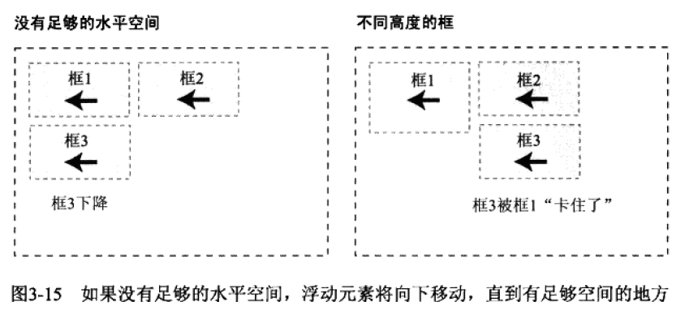
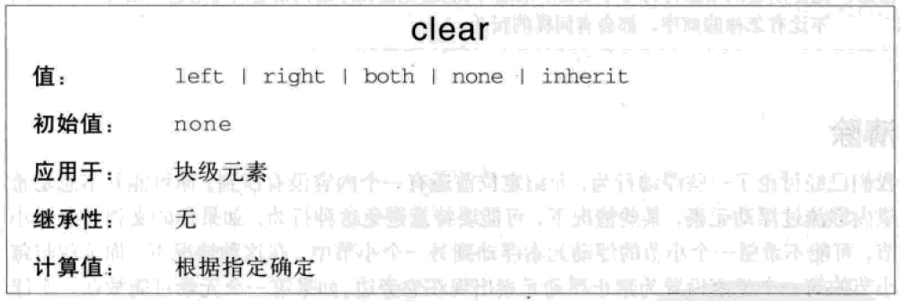
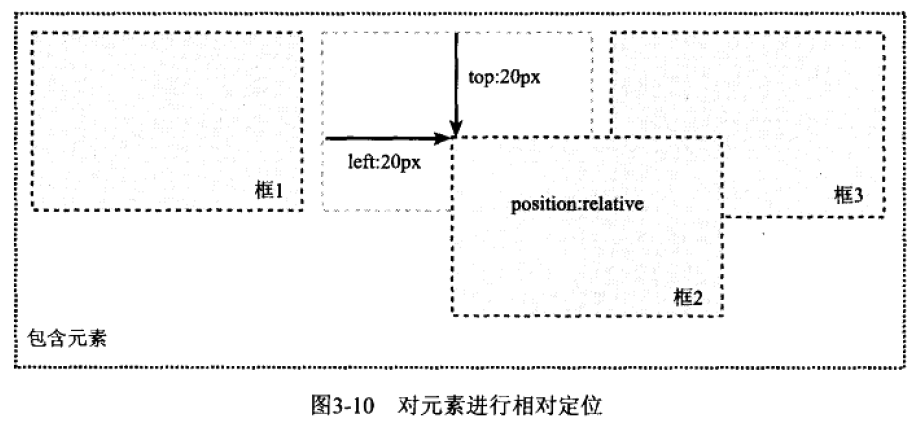
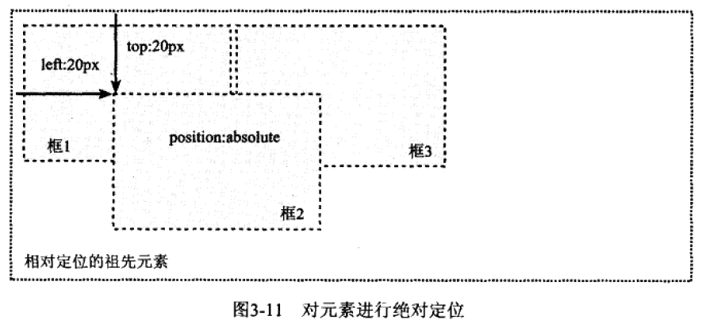
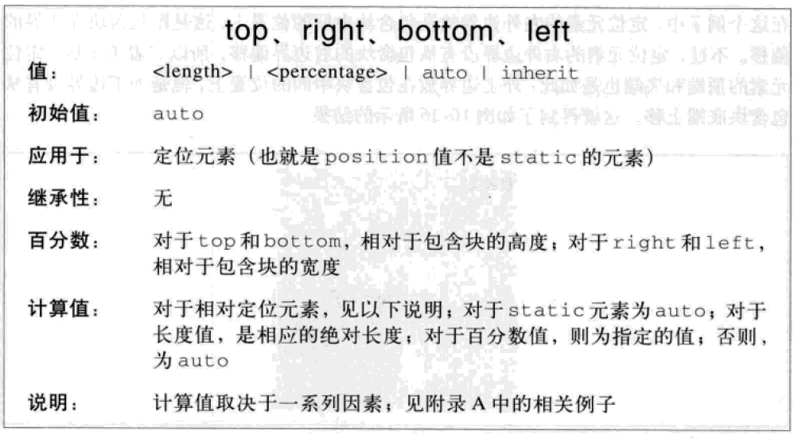
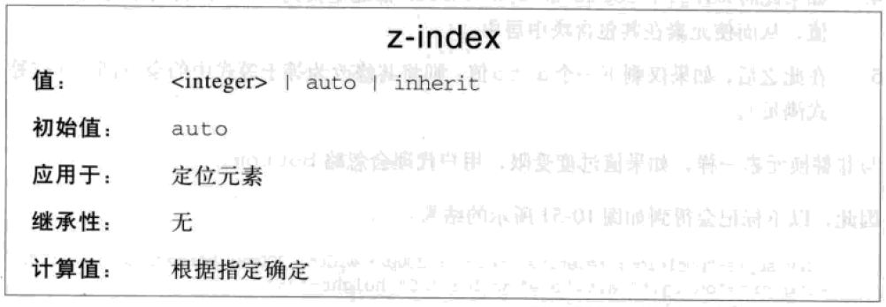

# 定位机制

* 普通流
* 浮动
* 定位

## 普通流

* 元素的位置由元素在`HTML`中的位置决定
* 块级框从上到下一个接一个排列，框的水平部分总和等于父元素的宽，框之间的垂直距离由框的垂直外边距合并而成
* 行内框在一行中水平排列，内边距、边框、外边距对非替换元素无垂直效果，对替换元素（如图片、文本框）有垂直效果，`vertical-align`影响垂直分布

## 浮动

浮动的框可以向左或向右移动，直到它的外边缘碰到父元素框或另一个浮动框为止

* `float`: 浮动, 默认为`none`
  * `none`: 不浮动
  * `left`: 向左浮动，自动变成块级框，原来所占的位置删除，周围内容环绕浮动元素
  * `right`: 向右浮动，自动变成块级框，原来所占的位置删除，周围内容环绕浮动元素




尺寸不够时往下排列


与内容重叠时

* 与行内框重叠，行内框的边框、背景、内容在浮动元素之上显示
* 与块框重叠，边框、背景在浮动元素之下，内容在浮动元素之上

清除浮动

* `clear`: 清除浮动，默认为`none`
  * `none`: 不清除浮动
  * `left`: 清除左浮动，元素左边不允许有浮动内容
  * `right`: 清除右浮动，元素右边不允许有浮动内容
  * `both`: 清除左右浮动，元素左右两边不允许有浮动内容




```css
/*清除浮动*/

.clearfix::before,
.clearfix::after{
  content:" ";
  display:table;
}

.clearfix::after{
  clear:both
}

/* or */
parent{
  overflow:hidden;
}

/* or */
parent{
  float:left;
}
```

## 定位

以外边距框来完成偏移

* `position`: 定位，默认为`static`
  * `static`: 静态定位，元素框正常生成，块级元素生成块框，行内元素生成行内框
  * `relative`: 相对定位，元素框可以相对于原来的位置偏移，原来所占的位置仍保留
  * `absolute`: 绝对定位，元素框可以相对于最近的已定位的祖先元素的内边距框偏移(没有时相对于`body`元素)，自动变成块级框，原来所占的位置删除
  * `fixed`: 固定定位，元素框可以相对于浏览器窗口位置偏移，自动变成块级框，原来所占的位置删除，页面滚动时仍不动






* `top`: 盒模型的上偏移，正数对应下移，默认为`auto`
* `bottom`: 盒模型的下偏移，正数对应上移，默认为`auto`
* `left`: 盒模型的左偏移，正数对应右移，默认为`auto`
* `right`: 盒模型的右偏移，正数对应左移，默认为`auto`



* `z-index`: 堆叠顺序，默认为`auto`
  * `auto`: 与父元素堆叠顺序相同
  * `number`: 相对于父元素的堆叠顺序

