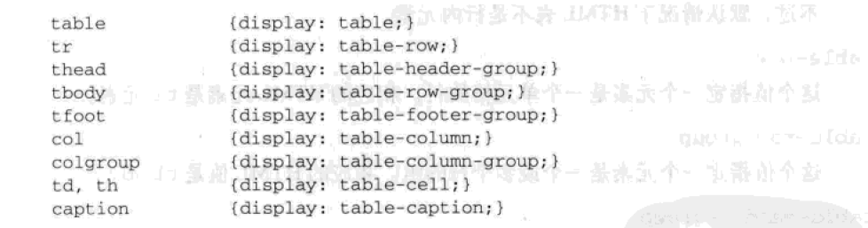
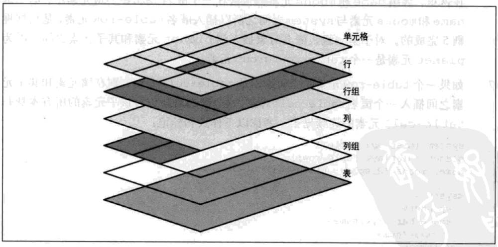
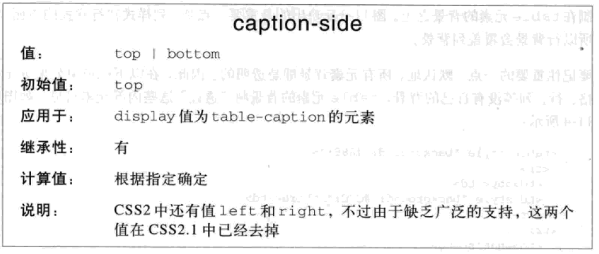
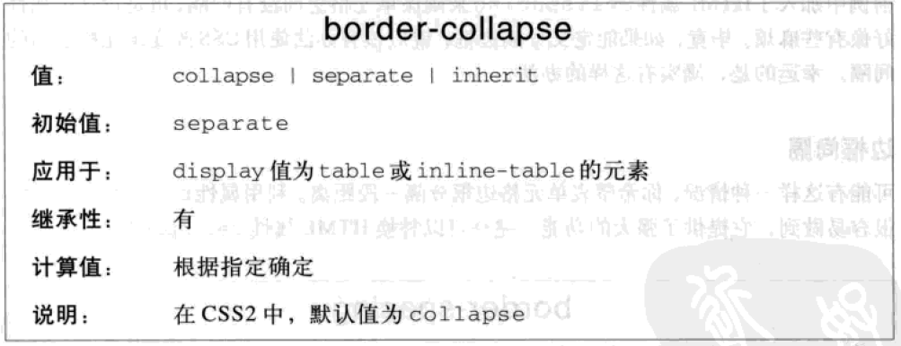
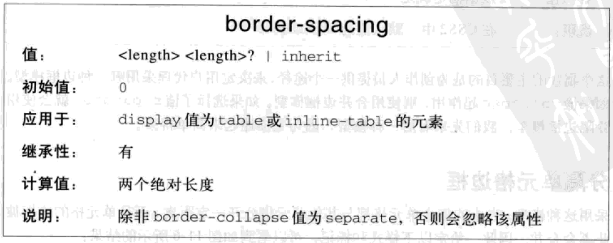
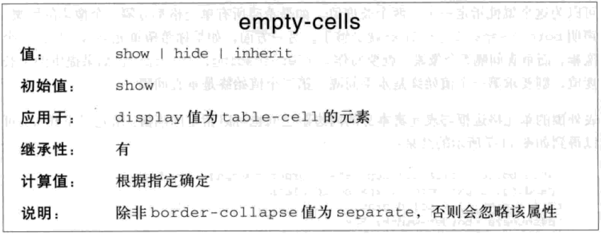
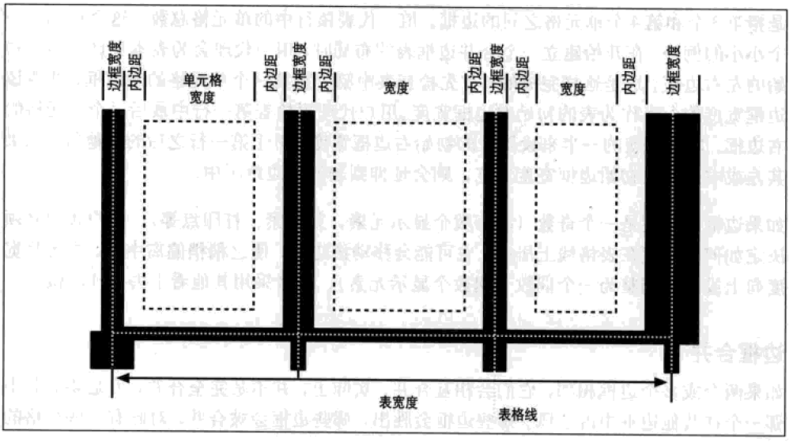
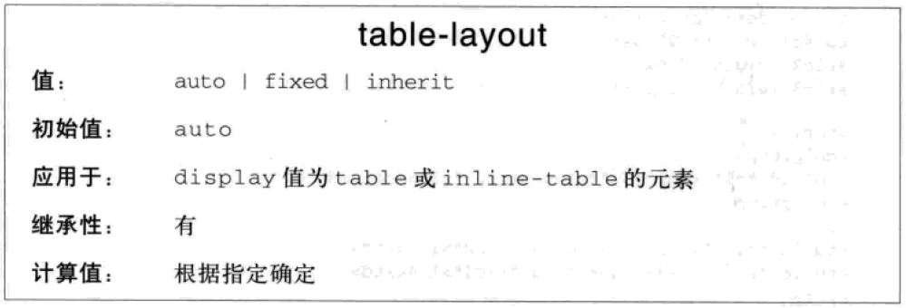

# 表布局

CSS中的表布局

## 表元素

根据`display`属性的值判断

* `table`: 块级表
* `inline-talbe`: 行内表
* `table-row`: 行
* `table-row-group`: 行组
* `table-header-group`: 表头
* `table-footer-group`: 表注
* `table-colume`: 列
* `table-column-group`: 列组
* `table-cell`: 单元格
* `table-caption`: 表标题

## 表编排

* 行框包含一行表格单元，所有行框按其出现的顺序从上到下地填充表
* 行组包括多个行框
* 列框包含一列或多列表格单元，所有列框按其出现的顺序依次相邻放置
* 列组包含多个列框
* 单元格可能跨多行或多列
* 单元格不能超出表或行组的最后一个行框
* 单元格有内容、内边距、边框，无外边框，设置外边框样式时会被忽略
* 行框的表格单元的高度相等，列框的表格单元的宽度相等
* 以行为主，列从行中推导出来
* 最少需要表、行、单元格三个元素才能组成表，缺少时插入匿名表对象

## 表层

## 列

列和列组只能接受四种样式

* `border`: 分隔边框模型时才能设置边框
* `background`: 根据表层确认是否会被覆盖
* `width`: 列或列祖的最小宽度
* `visibility`: 只有`collapse`才有用，其它忽略

## 表标题

一小段文本，描述表内容的本质

* `caption-side`: 标题位置，默认`top`
  * `top`: 表格之上
  * `bottom`: 表格之下

## 边框模型

* `border-collapse`: 边框模型，默认`separate`
  * `separate`: 分隔边框模型
  * `collapse`: 合并边框模型

### 分隔边框模型

边框间隔

* `border-spacing`: 单元格边框间隔
  * `x`: 水平与垂直间隔
  * `x y`: 水平间隔、垂直间隔

空单元格处理

* `empty-cells`: 空单元格处理
  * `show`: 显示空单元格的边框和背景
  * `hide`: 不显示空单元格的边框和背景

### 合并单元格模型

合并规则

* 表忽略内边距，单元格忽略间隔
* 多个边框相邻时，相互合并，取优先级最大的哪一个边框
  * 边框样式为`hidden`，优先级最高
  * 边框样式为`none`，优先级最低
  * 边框宽度不同，宽度大的优先级高
  * 边框宽度相同，比较边框样式，优先级从高到低`double, solid, dashed, dotted, ridge, outset, groove, inset`
  * 边框宽度、样式相同时，比较边框颜色，优先级从高到低`cell, row, row group, column, column group, table`

## 布局方式

* `table-layout`: 表格布局方式，默认为`auto`
  * `auto`: 自动布局
  * `fixed`：固定布局

### 固定布局

* 查找列宽度
* 列宽度为`auto`, 查找首行单元格的宽度
* 首行单元格宽度仍为`auto`, 则自动计算
* 列宽度之和大于表宽度，则表宽度为列宽度之和
* 列宽度之和小于表宽度，则将多余的宽度平均加到每一列上

### 自动布局

* 对于一列中的各个单元格，计算最小和最大单元格宽度
* 对于各列，计算最小和最大单元格宽度
* 表宽度为`auto`，列宽之和为表宽度
* 表宽度不为`auto`，比较列宽之和和表宽度，大的为表宽度

## 对齐

* 水平对齐：`text-align`
* 垂直对齐：`vertical-align`，通过调整单元格的上下内边距来垂直对齐
  * 只有`top, bottom, middle, baseline`四个值，其他值忽略