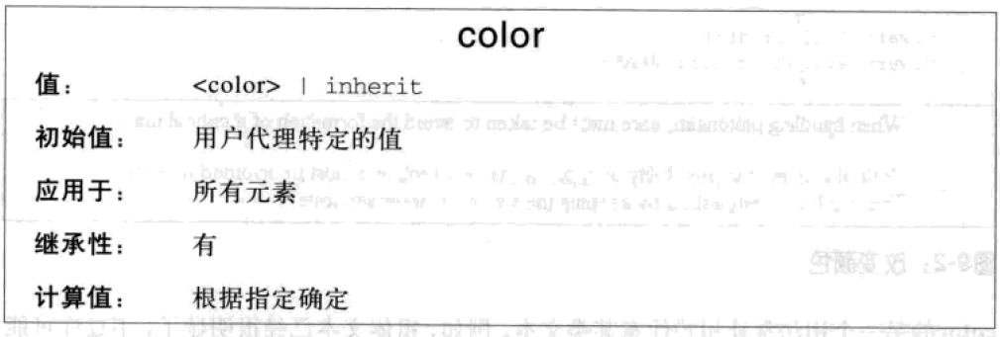
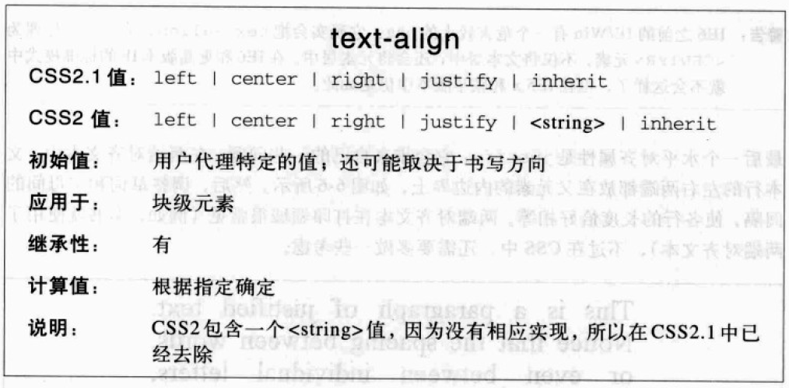
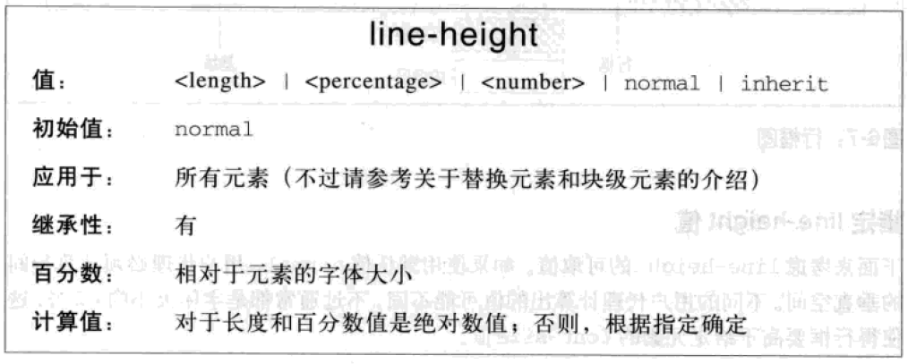
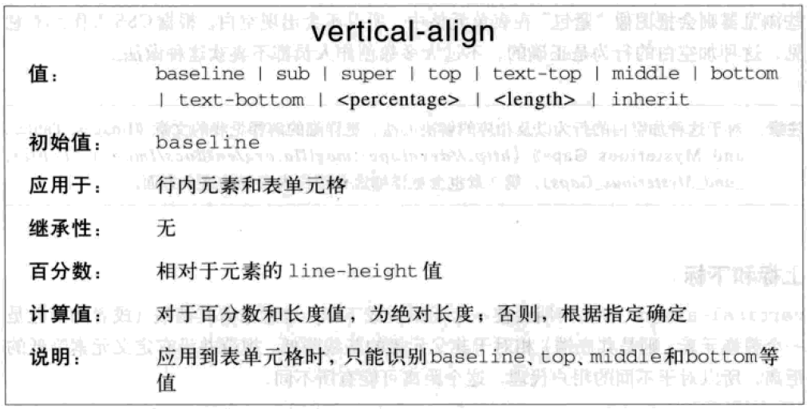
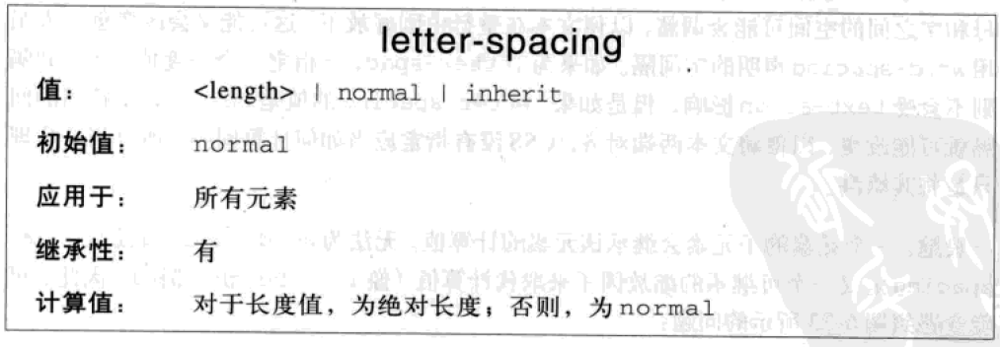
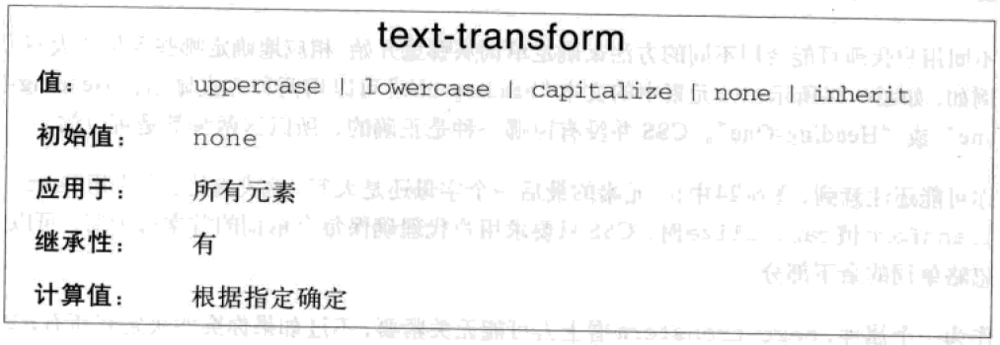
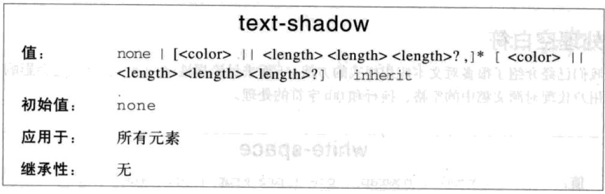
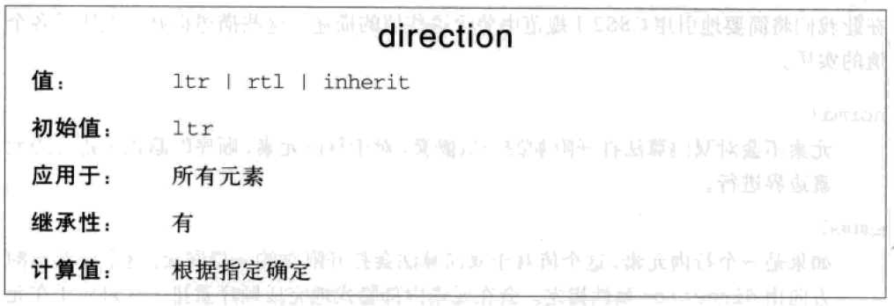

# 文本样式

## 注释

```css
/* comment */
```

## 字体

* `font-family`: 文本的字体
  * `字体`: 可定义多个字体作为备用，字体间用`,`隔开，最后一个通常为字体系列，字体名有空格或`#`,`$`时需要用引号


* `font-style`: 字体风格，默认为`normal`
  * `normal`: 正常显示
  * `italic`: 斜体显示
  * `oblique`: 倾斜显示


* `font-variant`: 字体变形，默认为`normal`
  * `normal`: 正常
  * `small-caps`: 小型大写字母


* `font-weight`: 字体加粗，默认为`normal`
  * `normal`: 正常
  * `bold`: 粗体
  * `bolder`: 更粗
  * `lighter`: 更细
  * `<100|200...|900>`: 400相当于`normal`，700相当于`bold`


* `font-size`: 字体大小, 默认为`medium`
  * `length`: 具体长度
  * `em|percentage`: 相对于父字体大小
  * `关键字`：`xx-small, x-small, small, medium, large, x-large, xx-large, smaller, larger`


* `font:[font-style] [font-variant] [font-weight] <font-size[/line-height]> <font-family>`: 字体


## 文本

* `color`: 文本颜色



* `text-indent`: 缩进
  * `length`: 具体长度
  * `em`: 相对于自身字体大小
  * `percentage`: 相对于父元素的宽度


* `text-align`: 水平对齐
  * `left`: 左对齐
  * `center`: 居中对齐
  * `right`: 右对齐
  * `justify`: 两端对齐



* `line-height`: 行高，默认为`normal`
  * `normal`: 正常，通常为`1.2em`
  * `length`：具体长度
  * `em|percentage`: 相对于自身字体大小
  * `number`: 缩放因子，相对于自身字体大小



* `vertical-align`: 垂直对齐, 默认为`baseline`
  * `baseline`: 行内框的基线与行框的基线对齐
  * `sub`: 行内框的基线与行框的下标基线低
  * `super`: 行内框的基线与行框的上标基线高
  * `top`: 行内框的顶端与行框的顶端对齐
  * `text-top`: 行内框的顶端与行框字体的顶端对齐
  * `middle`: 行内框的中线与行框基线上方的`0.5ex`处对齐
  * `bottom`: 行内框的底端与行框的底端对齐
  * `text-bottom`: 行内框的底端与行框字体的底端对齐
  * `length`: 相对于行框的基线升高或降低
  * `percentage`: 相对于`line-height`而言



* `word-spacing`: 字间隔，默认为`normal`
  * `normal`: 正常间隔，相当于`0`
  * `length`：具体长度


* `letter-spacing`: 字母间隔，默认为`normal`
  * `normal`: 正常间隔，相当于`0`
  * `length`：具体长度



* `text-transform`: 文本转换，默认为`none`
  * `none`: 不处理
  * `uppercase`: 全大写
  * `lowercase`: 全小写
  * `capitalize`: 首字母大写



* `text-decoration`: 文本装饰，默认为`none`，可指定多个，颜色为文本颜色
  * `none`: 无装饰
  * `underline`: 下划线
  * `overline`: 上划线
  * `line-through`: 删除线
  * `blink`: 闪烁


* `text-shadow: [h-shadow] [v-shadow] [blur] [color]...`: 文本阴影，可指定多个
  * `h-shadow`: 阴影的水平偏移
  * `v-shadow`：阴影的垂直偏移
  * `blur`: 模糊距离
  * `color`: 阴影颜色，默认为文本颜色



* `white-space`: 空白符处理，默认为`normal`
  * `normal`: 合并空白符，忽略换行符，允许自动换行
  * `nowrap`: 合并空白符，忽略换行符，不允许自动换行
  * `pre`: 保留空白符，保留换行符，不允许自动换行
  * `pre-wrap`: 保留空白符，保留换行符，允许自动换行
  * `pre-line`: 合并空白符，保留换行符，允许自动换行


* `word-break`: 自动换行方式, 默认为`normal`
  * `normal`: 默认换行规则
  * `break-all`: 允许单词内换行
  * `keep-all`: 只能在半角空格或连字符处换行

* `word-wrap`: 长单词换行处理，默认为`normal`
  * `normal`: 长单词不自动换行
  * `break-word`: 长单词自动换行

* `text-overflow`: 文本溢出处理，要与`overflow:hidden`配合
  * `clip`: 修剪文本
  * `ellipsis`: 使用省略号代表修剪的文本
  * `string`: 使用指定字符串代表修剪的文本

* `cursor`: 光标，默认为`auto`
  * `url("<url>")`: 自定义光标
  * `auto`: 自动确定
  * `default`:  默认光标，通常为箭头
  * `pointer`: 手型
  * `crosshair`: 十字线
  * `move`: 移动
  * `<direction>-resize`: 调整大小
  * `text`: 文本
  * `wait`: 等待
  * `progress`: 忙碌
  * `help`: 帮助

`border-box`和伪元素都属于点击区域


* `direction`: 文本方向
  * `ltr`: 从左到右
  * `rtl`: 从右到左

